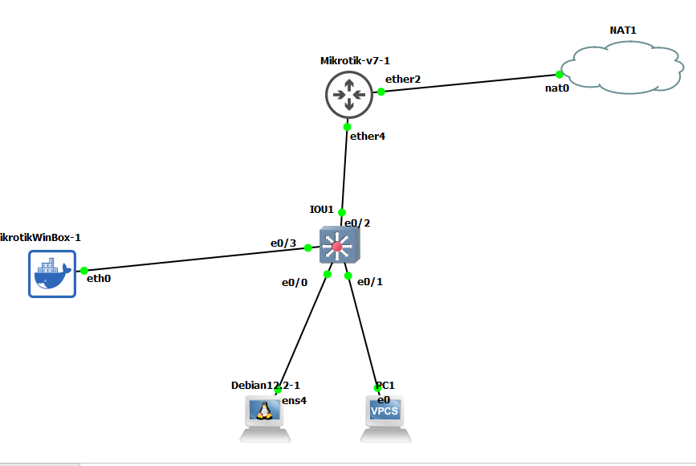

# MTCNA

* What is mikrotik: `MikroTik is a company based in Latvia.`

* what is differece between router-os vs router board
* `package section in version-6 vs version-7`


## start - Basic configuration

* reset configuration, and change the identity

```
system reset-configuration no-defaults=yes skip-backup=yes
system/identity/set name=R1

```

* `always use Safe Mode`: When you enable this feature, it will create a snapshot of the configurations. If your session times out, the configuration will revert to the backup.
* `Disable unused services`
```
ip service/print
ip service/disable ftp
ip service/disable telnet

```
* change default ports
* work with ftp, allow ftp only from white-list ip address
```
ip service set ftp address=192.168.229.0/2

```

* add disk and write file-system into it and connect to this with ftp


## Assgin Ip address on interfaces
* always change the name of interfaces 
```
# dhcp-client
ip dhcp-client/set interface=ether1 add-default-route=yes use-peer-ntp=yes use-peer-dns=yes


# static ip addressing
ip address/add interface=ether3 address=10.10.10.1/24


```

## give Internet access to your clients


`how we can set ip address on an interface:` 
* manual ip addressing
* dhcp client
* vpns
```
set interface=ether2 add-default-route=yes use-peer-ntp=yes use-peer-dns=yes

ip address/add interface=ether4 address=10.10.10.1/24


/ip pool
add name=dhcp_pool0 ranges=10.10.10.2-10.10.10.254

/ip dhcp-server
add address-pool=dhcp_pool0 interface=ether4 name=dhcp1
/ip dhcp-server network
add address=10.10.10.0/24 dns-server=10.10.10.1 gateway=10.10.10.1

/ip firewall nat
add action=masquerade chain=srcnat


/ip firewall nat
add action=masquerade chain=srcnat
```


* disable neighbor discovery

```
# disallow on all interfaces
/ip neighbor discovery-settings set discover-interface-list=none


# allow on specific interface list, 

/interface list add name=trust-list
/interface list member add interface=ether2 list=trust-lis
/ip neighbor discovery-settings set discover-interface-list=trust-list


```


* you can use ip scan to find ip addresses used in your network
```

tool/ip-scan interface=ether1
```


## DHCP configuration on Mikrotik
* DHCP-server
* DHCP-client
* DHCP-relay

* for security we can use dhcp-snooping, or we can use `alert` in mikrotik for searching another dhcp server exist in the network.


#### deploy dhcp server when we have multi-vlans


```
# IOU1
--------------------
vlan 10
name Accounting
vlan 20
name IT


interface ethernet 0/2
switchport trunk encapsulation dot1q
switchport mode trunk
switchport nonegotiate


int range eth 0/0-1
 switchport access vlan 10
 switchport mode access
 switchport nonegotiate


int range eth 0/3, eth 1/0
 switchport access vlan 20
 switchport mode access
 switchport nonegotiate

---------------------


# Mikrotik

----------------------

/interface vlan
add interface=ether4 name=vlan10 vlan-id=10
add interface=ether4 name=vlan20 vlan-id=20


/ip address
add address=10.10.10.1/24 interface=vlan10 network=10.10.10.0
add address=10.10.20.1/24 interface=vlan20 network=10.10.20.0


/ip pool
add name=dhcp_pool3 ranges=10.10.10.2-10.10.10.254
add name=dhcp_pool4 ranges=10.10.20.2-10.10.20.


/ip dhcp-server
add address-pool=dhcp_pool3 interface=vlan10 name=dhcp-vlan10
add address-pool=dhcp_pool4 interface=vlan20 name=dhcp-vlan20
/ip dhcp-server network
add address=10.10.10.0/24 dns-server=10.10.10.1 gateway=10.10.10.1
add address=10.10.20.0/24 dns-server=10.10.10.1 gateway=10.10.20.

----------------------

```

#### deploy dhcp-relay


```
# IOU1
--------------------
vlan 10
name Accounting
vlan 20
name IT
vlan 30
name Servers
exit

interface ethernet 0/2
switchport trunk encapsulation dot1q
switchport mode trunk
switchport nonegotiate


int range eth 0/0-1
 switchport access vlan 10
 switchport mode access
 switchport nonegotiate


int range eth 0/3, eth 1/0
 switchport access vlan 20
 switchport mode access
 switchport nonegotiate


int eth 1/3
 switchport access vlan 30
 switchport mode access
 switchport nonegotiate
---------------------


# Mikrotik

----------------------

/interface vlan
add interface=ether4 name=vlan10 vlan-id=10
add interface=ether4 name=vlan20 vlan-id=20
add interface=ether4 name=vlan30 vlan-id=30

/ip address
add address=10.10.10.1/24 interface=vlan10 network=10.10.10.0
add address=10.10.20.1/24 interface=vlan20 network=10.10.20.0
add address=10.10.30.1/24 interface=vlan30 network=10.10.30.0


/ip dhcp-relay
add dhcp-server=10.10.30.10 disabled=no interface=vlan10 name=relay-vlan10
add dhcp-server=10.10.30.10 disabled=no interface=vlan20 name=relay-vlan20
add dhcp-server=10.10.30.10 disabled=no interface=vlan30 name=relay-vlan3

----------------------


# DHCP server

----------------------

interface fastEthernet 0/0
ip address 10.10.30.10 255.255.255.0


ip dhcp pool vlan-10
 network 10.10.10.0 255.255.255.0
 dns-server 10.10.10.1 
 default-router 10.10.10.1


ip dhcp pool vlan-20
 network 10.10.20.0 255.255.255.0
 dns-server 10.10.10.1 
 default-router 10.10.20.1

ip dhcp pool vlan-30
 network 10.10.30.0 255.255.255.0
 dns-server 10.10.10.1 
 default-router 10.10.30.1


ip dhcp excluded-address 10.10.10.1 10.10.10.10
ip dhcp excluded-address 10.10.20.1 10.10.20.10
ip dhcp excluded-address 10.10.30.1 10.10.30.10


sh ip dhcp binding

----------------------


```


# tools for administration of your mikrotik

## manage user and groups in mikrotik

```


```


# syslog-grafana

```
# synchronize the date and time in your device
/system ntp client set enabled=yes
/system ntp client servers add address=ntp.day.ir

# v6
/system clockset time-zone-name=Asia/Tehran

# v7
system/clock/set time-zone-name=Asia/Tehran

/system logging action set 3 remote=<syslog-server-ip> src-address=<src-ip-address>
/system logging
set 0 action=remote
set 1 action=remote
set 2 action=remote
set 3 action=remote


# enable logging on firewall 

/ip firewall filter add action=log chain=input log=yes log-prefix="wowwwwwwww some one ping router" protocol=icmp
/ip firewall filter add action=add-src-to-address-list address-list=ping-router address-list-timeout=none-static chain=input protocol=icmp


# LOGQL


{hostname="10.10.1.1"}

{hostname=~".+", hostname!="192.168.229.170"}   # all logs but not for "192.168.229.170"

{hostname=~".+", hostname!="192.168.229.170"} |= "down"
{hostname=~"10.10.1.100|10.11.1.2"} |= "down"

{hostname=~".+"} |~ "[Dd]own"   # search for down or Down
{hostname=~".+"} |~ "down|Down"  # same as above


# SSH dashboard 

{hostname=~".+"} |~ "ssh|SSH"
{job="syslog"} |~ "ssh|SSH" |~ "Failed"

{job="syslog"} |~ "ssh|SSH" |~ "Failed" |~ "(?:25[0-5]|2[0-4][0-9]|[01]?[0-9][0-9]?)\\.(?:25[0-5]|2[0-4][0-9]|[01]?[0-9][0-9]?)\\.(?:25[0-5]|2[0-4][0-9]|[01]?[0-9][0-9]?)\\.(?:25[0-5]|2[0-4][0-9]|[01]?[0-9][0-9]?)"


{job="syslog"} |= "Failed" 


# annotation
{hostname=~".+"} |~ "ssh|SSH"  |~ "Failed"

```


## upgrade-downgrade(2-40)


## desgin skin (only works on web interface)
login to user mikrotik on web ui with admin priveleges, and create new skin(in the Desgin Skin section)


## Backup and Restore
we have two types of backups
* full backup (good for router itself)   .backup
* specific (export)           .rsc

1) full backup

```
# backup
go to the files and click on backup(you can set password on the backup file too.)


# restore go to the files and choose a file and then click on restore and reboot the system
```

2) specific backup
```
# Backup
export      # all static configuration

ip address/export
ip firewall/export file=firewall.rsc
mpls/export file=mpls.rsc


# Restore
import firewall.rsc

```

## Netinstall

## product Naming
